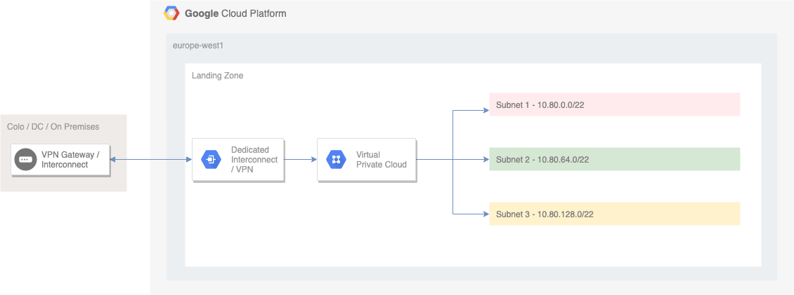
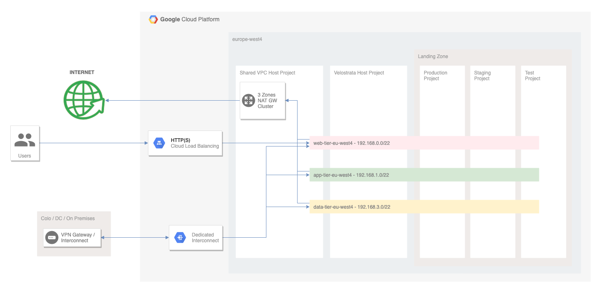

<!-----
 Copyright 2018 Google LLC

 Licensed under the Apache License, Version 2.0 (the "License");
 you may not use this file except in compliance with the License.
 You may obtain a copy of the License at

      http://www.apache.org/licenses/LICENSE-2.0

 Unless required by applicable law or agreed to in writing, software
 distributed under the License is distributed on an "AS IS" BASIS,
 WITHOUT WARRANTIES OR CONDITIONS OF ANY KIND, either express or implied.
 See the License for the specific language governing permissions and
 limitations under the License.
----->

# CFT Migrate for Compute Engine (Migrate for Compute Engine)

Using Cloud Foundation Toolkit (CFT) you can quickly deploy a landing zone for your [Migrate for Compute Engine](https://cloud.google.com/migrate/compute-engine/) migration to Google Cloud Platform (GCP) projects, save time and avoid misconfiguration issues.

## Migrate for Compute Engine Prerequisites

### Migration Qualification

Before proceeding with migration, you should already know:

1.  How many approximately VMs will be migrated
2.  What is migration target VMs source - Azure, AWS or on-prem
3.  How many GCP projects you will need for migrated VMs
4.  Do you have/plan on-prem or other cloud connection to GCP via [VPN](https://cloud.google.com/vpn/docs/concepts/overview) / [Interconnect](https://cloud.google.com/hybrid-connectivity/)
5.  Is there any network load balancing involved
6.  How much storage will be needed in GCP

### Deployment Type

There are two types of deployment that you can choose from using CFT for Migrate for Compute Engine:

**Single-project** deployment where Migrate for Compute Engine frontend, Cloud Extension and migrated VMs hosted under the same GCP project:

**Multi-project** deployment, environment is split into four or more different GCP projects to host separated shared VPC, Migrate for Compute Engine frontend and migrated VMs:

**Example** of high level architecture for a multi project landing zone:

### Technical Prerequisites

CFT for Migrate for Compute Engine is build on top of [Google Cloud Project Factory Terraform Module](https://github.com/terraform-google-modules/terraform-google-project-factory) and if additional customization needed please refer to the [documentation](https://github.com/terraform-google-modules/terraform-google-project-factory/blob/master/README.md).

You will create the following via CFT and Terraform:

1.  GCP project to host Migrate for Compute Engine Manager and Cloud Extensions (CE)
1.  GCP VPC Project (if shared VPC will be used)
1.  VPC with subnets
1.  [Firewall rules](https://cloud.google.com/migrate/compute-engine/docs/4.5/concepts/planning-a-migration/network-access-requirements) for Migrate for Compute Engine
1.  GCP Network Tags for Migrate for Compute Engine
1.  Destination Projects
1.  GCP [roles and service accounts](https://cloud.google.com/migrate/compute-engine/docs/4.5/how-to/configuring-gcp/configuring-gcp-manually) for Migrate for Compute Engine
1.  VPN (Optional)

Finally [deploying](https://cloud.google.com/migrate/compute-engine/docs/4.5/how-to/configure-manager/configuring-on-gcp) Migrate for Compute Engine Manager via GCP [Marketplace](https://console.cloud.google.com/marketplace/details/click-to-deploy-images/velostrata?_ga=2.230596124.-1830265044.1554384916&_gac=1.75634663.1564563946.CL6bne_m3uMCFYYkGwodLkkPoQ).
